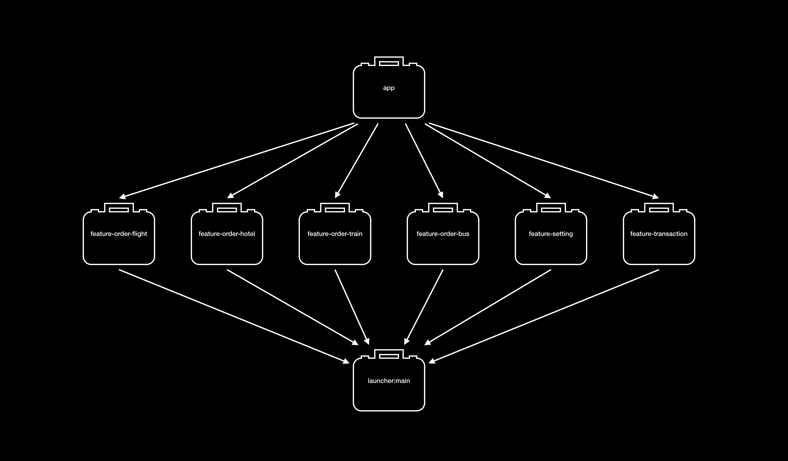
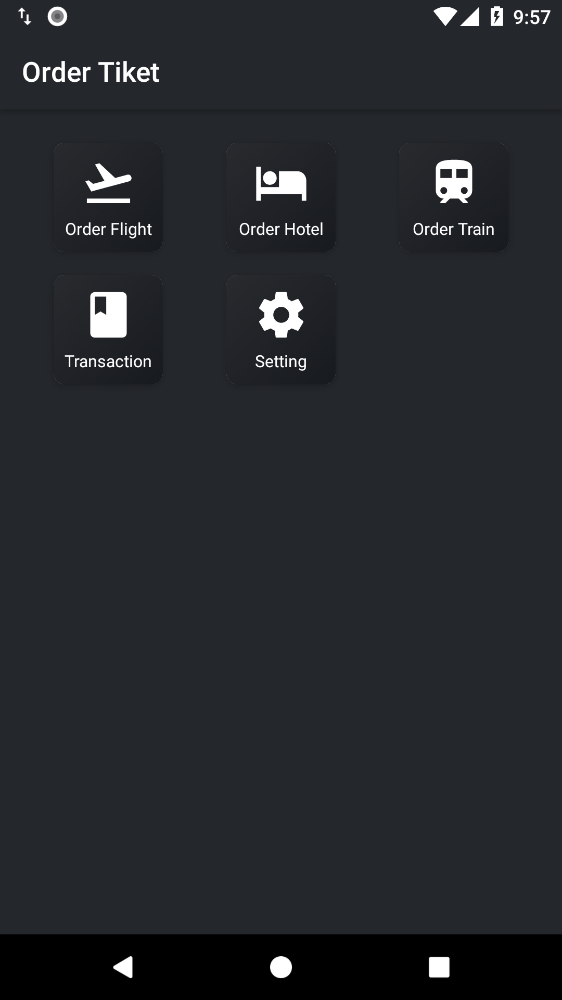
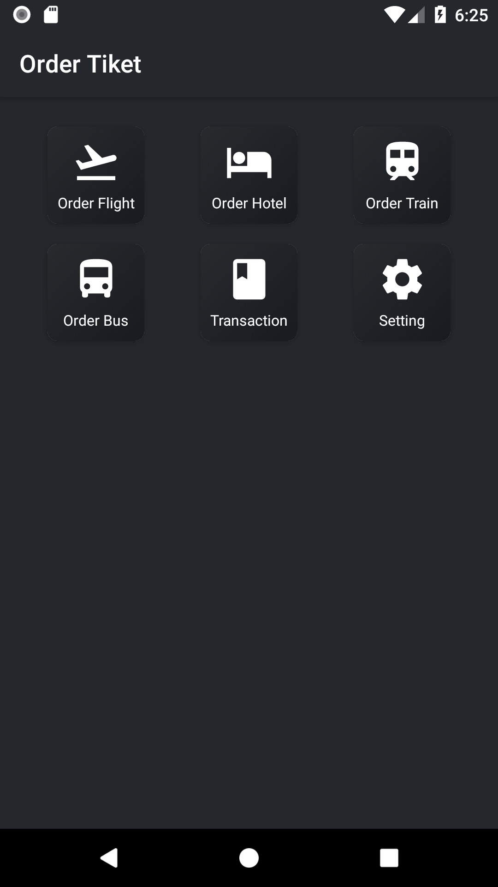

## Composable modular android app project

#### Dependencies diagram

#### Demo
https://youtu.be/bq7rSJuaz7U

#### Use case order ticket application that has more than one feature
1. Feature order flight
2. Feature order hotel
3. Feature order train
4. Feature transaction history
5. Feature setting

#### Implementation step by step
1. [Implement abstraction between app module and feature module using launcher module.](https://github.com/wisnukurniawan/Composable-Module/commit/3096f22a766e9dde9fef797a62daf04b5ca5ff6f) This is to make our app module not depend on feature module.
2. [Implement dynamic code loading using code generator x reflection.](https://github.com/wisnukurniawan/Composable-Module/commit/ccd5642ad674ecf8f54d2ad21e9bee75c30cfa5c) This is the main part how to make our module can be composable.
3. How to integrate new feature. Use case, adding order bus feature.
   - [Add order bus feature module.](https://github.com/wisnukurniawan/Composable-Module/commit/ea43996b83e1804d88addca5c8c3e3ff103a769c)
   - [Register order bus module as feature.](https://github.com/wisnukurniawan/Composable-Module/commit/82e5631bbf223c298f90565e6d4bac72a2095ce9)

#### Preview before after adding order bus feature
&emsp;

#### Reference
Scaling an Android App from 1 to 100 developers with modularization at Airbnb. https://youtube.com/watch?v=jrnhIgFzgns&t=466s